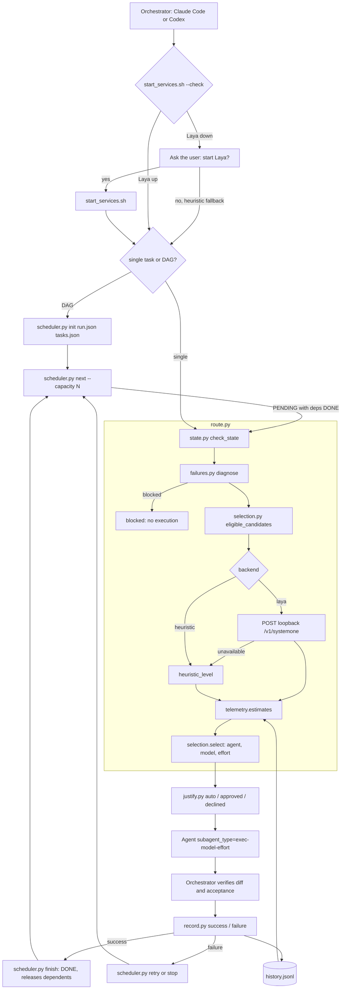

# cc-router


Claude Code and Codex skill that proposes a configurable **model + reasoning
 effort** for each delegated step, explains the decision, verifies results and
records outcomes. Routing scripts use Python standard library; native host
execution retains the existing login and permissions.

- Provider-neutral candidate catalogue; model names are configuration data.
- Eligibility checks, legacy heuristic fallback, and optional evidence-based
  `economy`, `balanced` and `performance` policies.
- Explicit approval, host confirmation, failure diagnosis and bounded retries.
- Event-driven DAG scheduler: classify only ready tasks, reserve independent work
  in parallel, validate completion and release dependents without an LLM watcher.
- Optional local Laya scores, clearly labelled uncalibrated until enough outcomes
  exist; no direct provider APIs, paid proxy or secondary execution CLI.
- Versioned task/attempt history plus workflow efficiency including planning,
  classification, delegation, execution, validation and rework; unknown stays unknown.

## Flow



## Requirements

- Claude Code with a subscription (check `/status`) or Codex with native subagent tools.
- Python 3.10+ in Linux/macOS/WSL; the routing scripts use only the standard library. Laya is optional.
- For the output helpers: Node.js and the [caveman](https://github.com/JuliusBrussee/caveman) and [ponytail](https://github.com/DietrichGebert/ponytail) integrations. Ponytail's Codex hooks need `node` on the shell's PATH.

## Installation

### Python dependencies

Only when opting into the Laya backend, install the Laya server (PyTorch, Transformers, FastAPI and Uvicorn come with it) in the Python 3.10+ environment you will use for the skill:

```bash
python3 -m pip install "laya[serve]"
```

The routing scripts themselves need only the standard library. After installing the skill below, start its services with `scripts/start_services.sh` (see [Use the public Laya checkpoint](#use-the-public-laya-checkpoint)).

### Codex

```bash
git clone https://github.com/g4br/cc-router ~/.codex/skills/cc-router
```

Codex uses the native agent tool when that session supports the proposed model and effort. No generated agent files are needed; routing never claims a proposal was applied.

Install caveman's **skill** for Codex, using the command from its [official README](https://github.com/JuliusBrussee/caveman):

```bash
npx skills add JuliusBrussee/caveman --skill '*' -a codex --yes -g
```

This installs the skill, not caveman's optional proxy. Install the [ponytail Codex plugin](https://github.com/DietrichGebert/ponytail) with its official commands:

```bash
codex plugin marketplace add DietrichGebert/ponytail
codex plugin add ponytail@ponytail
```

Start Codex, open `/hooks`, review and trust ponytail's two lifecycle hooks, then start a new thread. For the Codex desktop app, restart the app after installation. `node` must be on the PATH used by the hooks.

### Claude Code

```bash
git clone https://github.com/g4br/cc-router ~/.claude/skills/cc-router
```

Install the two plugins, one command per message:

```
/plugin marketplace add JuliusBrussee/caveman
/plugin install caveman@caveman
/plugin marketplace add DietrichGebert/ponytail
/plugin install ponytail@ponytail
```

Then:

```bash
python ~/.claude/skills/cc-router/scripts/install.py
```

In Claude Code, `install.py`:
- checks that no credential would move billing off the subscription and that the caveman and ponytail skills are installed;
- writes one agent per active candidate to `~/.claude/agents/`;
- writes the `permissions.ask` rules for rungs that need approval to `~/.claude/settings.json`, keeping the rest of the file.

On both hosts, `install.py` then chooses the backend. It never switches to `laya` by itself: it explains that the Laya difficulty gate has not passed yet and asks `Enable the Laya backend? [y/N]`. Only a yes installs `laya[serve]` if missing, downloads the public checkpoint and sets `backend` to `laya` in the active config. An empty answer or no sets `backend` to `heuristic`; stdin that is not a terminal leaves the current value unchanged. Pass `--backend laya` or `--backend heuristic` to choose without a question. When the value changes, the config is first copied to a timestamped `.bak` file next to it.

Each time the skill is invoked, it runs `scripts/start_services.sh --check`; if Laya is down it asks whether to start it and only then runs `scripts/start_services.sh`. A no keeps the heuristic fallback.

Restart Claude Code if `~/.claude/agents/` did not exist before.

In Codex, `install.py` detects the operator and exits without changing Claude Code files. If detection is unavailable, set `CC_ROUTER_OPERATOR` explicitly. The router never uses an API key as an operator signal.

## Usage

Ask the operator to use `cc-router` for a task suited to delegation. The minimal entrypoint is [SKILL.md](SKILL.md); load its references only as needed. Routing depends on the host's permission to delegate and its available models.

For dependent work, see [scheduler usage](references/scheduler.md). Decompose
into tasks, dependencies, ownership and acceptance criteria; the Python scheduler
selects models only when tasks become ready. Native host tools perform execution,
and validated completion events release dependents. The external CLI/app-server
executor remains an extension point, not an implemented adapter.

## Use the public Laya checkpoint

Install the [Python dependencies](#python-dependencies) first. Run the minimal SDK example from this repository in another terminal. It asks Laya to choose `low`, `medium` or `high` effort for `gpt-6.1-sol` on a sample task; the first run downloads the checkpoint:

```bash
python laya-example.py
```

Pass a different task in English to try it: `python laya-example.py "Debug a failing parser test"`.

For regular `cc-router` routing, start the local services:

```bash
scripts/start_services.sh
```

The script reads the port from `config/ladder.json`, starts the official Laya server in the background through `scripts/serve_laya.py`, waits until the checkpoint is loaded and prints the PID to stop it. If Laya is already running on that port, it does nothing. The log goes to `~/.local/state/cc-router/laya.log` (or `$XDG_STATE_HOME/cc-router/laya.log`).

The example and server launcher test a small PyTorch operation on available GPUs. They use a working GPU or fall back to CPU, including on an MX350 with a PyTorch build that cannot run `sm_61` kernels. The server listens on `127.0.0.1:8001` and loads only the English checkpoint by default.

Use a port that is free on your machine. If another service already uses the configured port, `start_services.sh` finds the next free port and asks `Use port XXXX?`. A yes saves that port in `laya_url` and both `laya_urls` entries in `config/ladder.json` and starts Laya on it. A no or an empty answer leaves everything unchanged. Without a terminal, pipe the answer: `echo y | scripts/start_services.sh`. Never point the router at another service's port: its error stops routing instead of triggering the heuristic fallback. See the [Laya guide](references/laya.md#installation-and-startup).

Both operators use `http://127.0.0.1:8001/v1/systemone` by default. The bundled `config/ladder.json` ships with `backend: heuristic` and `laya_mode: per_candidate`: these defaults reflect the Laya difficulty gate, which has not passed (2026-10-09: FAIL, insufficient labels). Once you have labelled at least 50 tasks (10 per level, see `tests/data/README.md`), re-run `python3 scripts/eval_difficulty.py --operator claude`; on PASS, set `backend` to `laya` and `laya_mode` to `difficulty`. See the [gate](references/laya.md#gate). With the Laya backend on, routing falls back to the heuristic if the server is unavailable or has no rung above the threshold. No training or GPU training job is needed. Laya's zero-shot scores for this model-selection question are unvalidated locally, so continue to verify outcomes. See the [Laya guide](references/laya.md) for setup and interpretation.

The skill translates each task summary into English for Laya to select the model and effort. It keeps the user's primary language for the delegated agent's report and the final response.

After each routed step, record whether it passed on the first attempt without rework and include reported token usage when available:

```bash
python scripts/record.py <decision-id> success 48210 37.5 --no-rework true
```

Token consumption is tracked separately from the outcome. It is not monetary cost or an exact subscription quota fraction; one run cannot establish how untried candidates would have performed.

## v2 configuration and compatibility

`CC_ROUTER_CONFIG` overrides `config/router.json` (if present), otherwise
`config/ladder.json`. The existing ladder is migrated in memory; no user config is
rewritten. `CC_ROUTER_OPERATOR=claude|codex` overrides session detection independently.

```bash
python scripts/migrate.py config/ladder.json > /tmp/router-preview.json
python scripts/migrate.py config/ladder.json --write config/router.json
```

Existing destinations receive a timestamped backup. Roll back by selecting the
original ladder with `CC_ROUTER_CONFIG`. Read the [schema and policy reference](references/router-v2.md)
for availability, supported combinations, version segmentation and policy weights.
All existing candidates remain in the bundled configuration. Host support and
billing inclusion must be confirmed; no additional model is inferred from its name.

The public single-state and batch CLI and output fields remain available:

```bash
CC_ROUTER_OPERATOR=codex python scripts/route.py '{"description":"Implement a parser and run roundtrip tests","operation":"implementation","files":2,"ambiguous":false,"critical":false}'
CC_ROUTER_OPERATOR=claude python scripts/route.py '{"description":"Implement a parser and run roundtrip tests","operation":"implementation","files":2,"ambiguous":false,"critical":false}'
```

Claude requires the corresponding generated agent. Both return an intention with
`execution.applied: false`. Use native tools and record actual host-reported settings.
See [examples](references/examples.md) for approval, recording and diagnosis.

Intentional corrections: invalid inputs now fail; unknown historical outcomes do
not count as successful completions; `failed_with` alone requests diagnosis rather
than automatically promoting a model. Laya scores are not guaranteed probabilities.
Legacy routing remains available through `policy: legacy` with current safety gates.

## Tests and offline benchmark

```bash
python -m unittest discover -s tests -v
python scripts/benchmark.py --output /tmp/cc-router-benchmark.json
```

Tests use temporary homes, mock native reports and a local mock Laya server. They
never install real host agents, start the Laya model or call a paid API. The benchmark
compares four policies across six task profiles and two hosts on identical synthetic
observations. It measures policy behavior, not real-model performance or savings.
See [implementation and validation record](references/implementation.md).

## Files

| File | Purpose |
|---|---|
| `SKILL.md` | Minimal bootstrap and conditional reference links |
| `laya-example.py` | Example of Laya choosing effort for a fixed model |
| `config/ladder.json` | Operator-specific ladders, heuristic, limits and settings |
| `scripts/install.py` | Builds the agents and the approval rules |
| `scripts/route.py` | Stable CLI, legacy helpers and v2 decision orchestration |
| `scripts/candidates.py`, `state.py` | Configuration migration, capabilities and strict validation |
| `scripts/selection.py`, `telemetry.py`, `failures.py` | Policy, comparable observations and failure diagnosis |
| `scripts/scheduler.py` | Persistent DAG reservations, completion events and workflow efficiency |
| `references/scheduler.md`, `protocol.md` | On-demand orchestration and execution details |
| `scripts/planning.py`, `verify_batch.py` | Dependency waves and actual-change ownership checks |
| `scripts/migrate.py`, `benchmark.py` | Explicit migration/backup and reproducible offline comparison |
| `scripts/justify.py` | Logs the justification and the user's answer |
| `scripts/record.py` | Logs the step's result |
| `scripts/feedback.py` | Corrects a no-rework label discovered after recording |
| `scripts/laya_device.py` | Checks which GPU can run PyTorch, with CPU fallback |
| `scripts/serve_laya.py` | Starts the official Laya server on the selected device |
| `scripts/start_services.sh` | Starts Laya in the background on the port set in `config/ladder.json` |
| `references/examples.md` | Current commands and examples for both hosts; archived v1 examples linked there |
| `scripts/labels_from_history.py` | Difficulty labels (exact and censored) from `history.jsonl` |
| `scripts/eval_difficulty.py` | Offline evaluation of four difficulty strategies and the Laya gate |
| `scripts/calibrate_difficulty.py` | Fits the Laya temperature and abstention threshold from labels |
| `tests/data/difficulty_gold.jsonl` | Gold set to label (format in `tests/data/README.md`) |
| `references/laya.md` | Public Laya checkpoint setup and decision limits |

History lives in `~/.claude/cc-router/history.jsonl` or `~/.codex/cc-router/history.jsonl`, according to the detected operator.

## License

MIT
